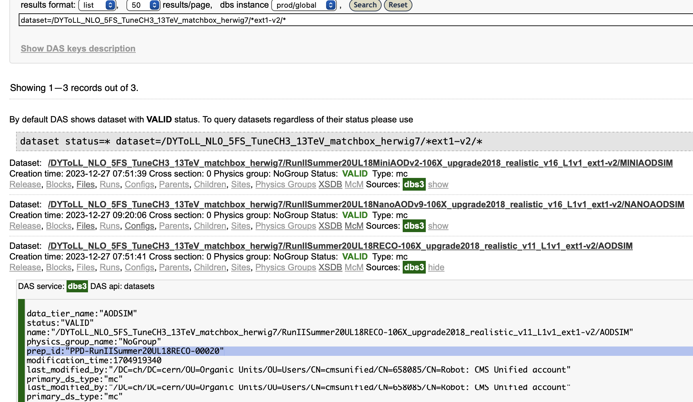
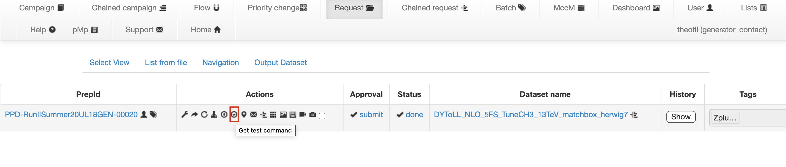
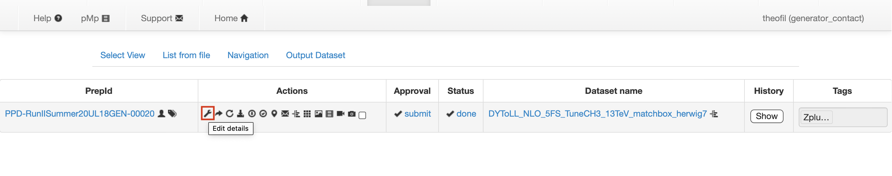

# CMS_Herwig_tutorial_2024

## Setup

For this tutorial we will use CMSSW_13_3_2 on lxplus 9. To set this up, run the following commands:

```
# login to lxplus, we assume bash as shell 
# i.e., echo $SHELL should print out '/bin/bash'

cmsrel CMSSW_13_3_2
cd  CMSSW_13_3_2/src
cmsenv
# Clone this repository into the src directory:
git clone git@github.com:Dominic-Stafford/CMS_Herwig_tutorial_2024.git
# Build cmssw so that it can find the gen fragments:
scram b -j 4
```

## Standalone LO generation

In this repository we provide a number of generator fragments to run the different examples. A fragment is a part of a configuration containing only the information specific to the physics process. To convert this into a full configuration one needs to use the cmsDriver command, which adds details of output formats and the conditions for the run:

```
cmsDriver.py CMS_Herwig_tutorial_2024/standalone/python/DYToLL_TuneCH3_13TeV_herwig7_cff.py --python_filename DYToLL_TuneCH3_13TeV_herwig7_cfg.py --eventcontent RAWSIM,NANOAODGEN --datatier GEN,NANOAOD --fileout file:standalone_DY.root --conditions 106X_upgrade2018_realistic_v4 --beamspot Realistic25ns13TeVEarly2018Collision --step GEN,NANOGEN --geometry DB:Extended --era Run2_2018 --no_exec --mc --customise_commands process.MessageLogger.cerr.FwkReport.reportEvery="int(1000)" -n 5000
```

Move the completed fragment into an appropriate test directory, and run it using the "cmsRun" command:

```
mkdir -p test/standalone
cd test/standalone
cp ../../DYToLL_TuneCH3_13TeV_herwig7_cfg.py .
cmsRun DYToLL_TuneCH3_13TeV_herwig7_cfg.py
```

This should produce a large number of files:

 - HerwigConfig.in - Herwig input file produced by CMSSW
 - standalone_DY.run - non-human readable run card produced by Herwig
 - standalone_DY-S123456790.log - Detailed Herwig log (includes full event record for a few events)
 - standalone_DY-S123456790.out - Herwig process summary (including xs)
 - standalone_DY-S123456790.tex - Herwig credits
 - standalone_DY.root - CMS GEN data-tier ROOT file for further processing
 - standalone_DY_inNANOAODGEN.root - Events in NanoAOD-like format
 - standalone_DY.yoda - Rivet histograms
 
Try having a look in the .in, .log and .out text files, as well as opening the NanoAODGen file. You can then make the rivet plots using the following command:

```
rivet-mkhtml --mc-errs standalone_DY.yoda
```

### Extension: changing the collision energy

In the previous example we considered 13 TeV collisions, with the conditions from 2018. To generate events for Run 3, one would first need to change the line in the fragment specifying the collision energy to Herwig:

```
'set EventGenerator:EventHandler:LuminosityFunction:Energy 13000.0'
``` 

Then, one needs to re-run cmsDriver with the appropriate conditions:

```
cmsDriver.py CMS_Herwig_tutorial_2024/standalone/python/DYToLL_TuneCH3_13TeV_herwig7_cff.py --python_filename DYToLL_TuneCH3_13TeV_herwig7_cfg.py --eventcontent RAWSIM,NANOAODGEN --datatier GEN,NANOAOD --fileout file:standalone_DY.root --conditions 124X_mcRun3_2022_realistic_v12 --beamspot Realistic25ns13p6TeVEarly2022Collision --step GEN,NANOGEN --geometry DB:Extended --era Run3 --no_exec --mc --customise_commands process.MessageLogger.cerr.FwkReport.reportEvery="int(1000)" -n 5000
```

Try running the config thus produced (in a new test directory). You can then compare the plots at the two different collision energies by passing them both to rivet-mkhtml:

```
rivet-mkhtml --mc-errs standalone_DY_Run2.yoda standalone_DY_Run3.yoda
```

## Showering external lhe files

To produce the full configs for the external lhe examples from the fragments, one just needs to add "LHE" to the `--step` argument:

```
cmsDriver.py CMS_Herwig_tutorial_2024/external_lhe/python/DY_LO_MG_Hw_cff.py --python_filename DY_LO_MG_Hw_cfg.py --eventcontent RAWSIM,NANOAODGEN --datatier GEN,NANOAOD --fileout file:LO_MG_DY.root --conditions 106X_upgrade2018_realistic_v4 --beamspot Realistic25ns13TeVEarly2018Collision --step LHE,GEN,NANOGEN --geometry DB:Extended --era Run2_2018 --no_exec --mc --customise_commands process.MessageLogger.cerr.FwkReport.reportEvery="int(1000)" -n 5000
```

The configs can then be run in the same way as before:

```
mkdir -p test/LO_MG
cd test/LO_MG
cp ../../DY_LO_MG_Hw_cfg.py .
cmsRun DY_LO_MG_Hw_cfg.py
```

Try changing these commands to also run the NLO and 2 additional jets examples.

## Herwig in matchbox mode

Matchbox is a mode of Herwig that allows to use external (NLO) ME providers to do the showering and the hadronization, all in one go within Herwig i.e., no need to produce LHE files and pass them for the matching/merging/hadronization to Herwig. 

A first sample with NLO DY->ll exists for Run 2 with UL conditions, consisting of 120 M events and is available in [DAS](https://cmsweb.cern.ch/das/request?view=list&limit=50&instance=prod%2Fglobal&input=dataset%3D%2FDYToLL_NLO_5FS_TuneCH3_13TeV_matchbox_herwig7%2F*ext1-v2%2F*). 

Here we will learn how to find ourselves configuration used for it. We can generate, if we wish, few events of this sample without modifying anything using **singularity**.  We can find the prep-id used for GEN step by going to the **parent** **AOD** in DAS and clicking on the **dbs3show**.



The prep-id used for this sample in MCM is the [PPD-RunIISummer20UL18GEN-00020](https://cms-pdmv-prod.web.cern.ch/mcm/requests?prepid=PPD-RunIISummer20UL18GEN-00020&page=0&shown=127). Now we will go to MCM and get the **test command**.



Generating some events interactively will need ~20 minutes of time. It is better that we login again to lxplus into a new session and do this in our tmp folder. We will let it run in a separate terminal during the tutorial session and look back at it in the end.

```
cd /tmp/$USER

wget https://cms-pdmv-prod.web.cern.ch/mcm/public/restapi/requests/get_test/PPD-RunIISummer20UL18GEN-00020

source PPD-RunIISummer20UL18GEN-00020
```


### Updating the Run-2 UltraLegacy card for Run 3

As next part of our tutorial, we will find the configuration used for the Run 2 ultralegacy sample sample. We can go to the edit details and find out the configuration fragment, as well as the cross section of this sample, which is **6048 pb**.



The configuration for this sample has been extracted from MCM and placed in ```CMS_Herwig_tutorial_2024/matchbox/DYToLL_NLO_5FS_TuneCH3_13TeV_matchbox_herwig7_cff.py```.

We go back to our tutorial's installation in lxplus.

```
cd $CMSSW_BASE/src/  

nano CMS_Herwig_tutorial_2024/matchbox/DYToLL_NLO_5FS_TuneCH3_13TeV_matchbox_herwig7_cff.py

cmsDriver.py CMS_Herwig_tutorial_2024/matchbox/python/DYToLL_NLO_5FS_TuneCH3_13TeV_matchbox_herwig7_cff.py --python_filename DYToLL_NLO_5FS_TuneCH3_13TeV_matchbox_herwig7_cff_cfg.py --eventcontent RAWSIM --customise Configuration/DataProcessing/Utils.addMonitoring --datatier GEN --fileout file:DYToLL_NLO_5FS_TuneCH3_13TeV_matchbox_herwig7.root --conditions 106X_upgrade2018_realistic_v4 --beamspot Realistic25ns13TeVEarly2018Collision --step GEN --geometry DB:Extended --era Run2_2018 --no_exec --mc -n 5000


### cmsDriver.py CMS_Herwig_tutorial_2024/matchbox/python/DYToLL_NLO_5FS_TuneCH3_13TeV_matchbox_herwig7_cff.py --python_filename DYToLL_NLO_5FS_TuneCH3_13TeV_matchbox_herwig7_cfg.py --eventcontent RAWSIM,NANOAODGEN --datatier GEN,NANOAOD --fileout file:standalone_DY.root --conditions 106X_upgrade2018_realistic_v4 --beamspot Realistic25ns13TeVEarly2018Collision --step GEN,NANOGEN --geometry DB:Extended --era Run2_2018 --no_exec --mc --customise_commands process.MessageLogger.cerr.FwkReport.reportEvery="int(1000)" -n 5000

mkdir test/matchbox
cd test/matchbox
cp ../../DYToLL_NLO_5FS_TuneCH3_13TeV_matchbox_herwig7_cfg.py .

# This will speed-up generation for the tutorial 
# Do not do it, if you make any changes in the configuation
cp /afs/cern.ch/user/t/theofil/public/CMS_Herwig_tutorial_2024/Herwig-cache.tar.bz2
tar -xjvf Herwig-cache.tar.bz2

```
 
